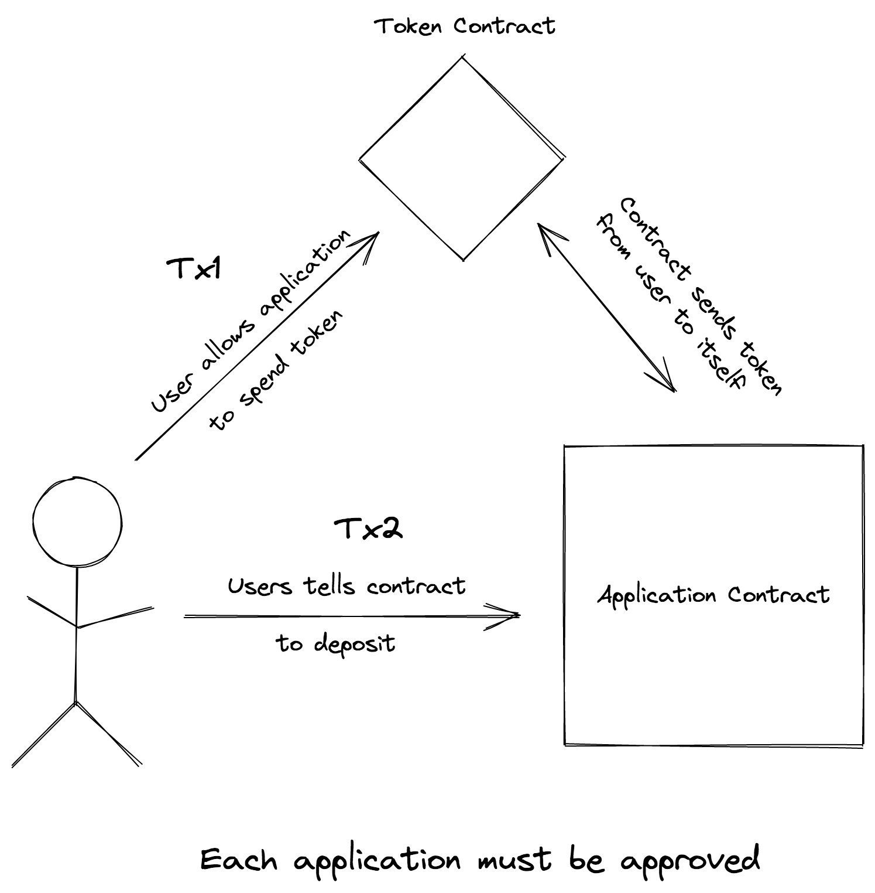
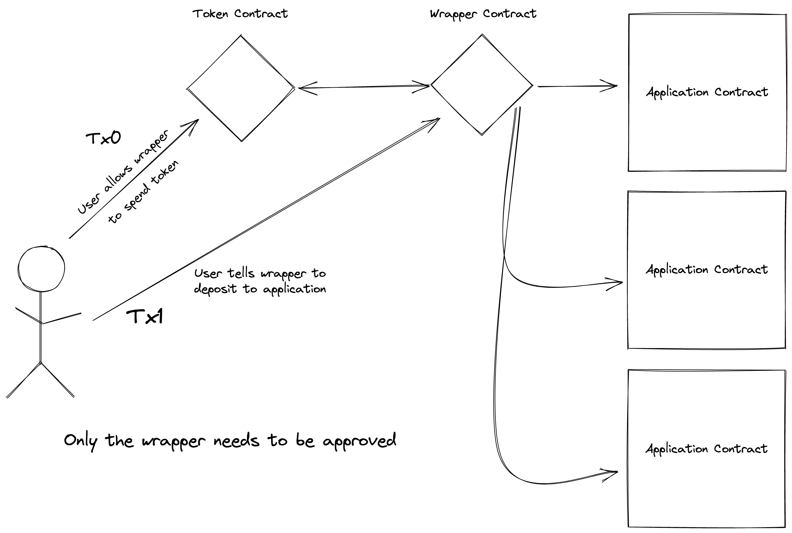

# Wrapped Deposit

A method of depositing ERC20 tokens with fewer transactions and less risk.

## How it works

A user approves the wrapped deposit token to spend tokens on their behalf. Applications needing to accept deposits implement the following function:

```js
function acceptDeposit(address depositor, address token, uint amount) returns (bool);
```

Applications then have the user send a transaction to the deposit wrapper like this:
```js
// to is the application address
depositToken(address to, address token, uint amount);
```

## Difference from existing models

### Current model

The user must first approve an application to spend tokens on their behalf. Then the user sends a second transaction asking the application to send tokens to itself from the user. This is necessary so the application can perform deposit logic, like updating the deposit balance for the user.



### Wrapped model

The user approves the wrapped deposit contract to spend tokens on their behalf. Then the user asks the wrapped deposit contract to deposit to an application on their behalf. Only the wrapped deposit contract needs to be approved to spend tokens. The wrapped deposit contract can send tokens to any number of application contracts.



## Advantages

#### Fewer transactions

Users only need to approve a token to be spent once.

#### More safe

Users only need to approve one contract to spend their tokens. They don't need to trust application contracts with token spend approvals.

The wrapped deposit contract is short and simple (less than 50 lines of code) and therefore less likely to contain exploits.

#### Developer friendly

The wrapped deposit contract offers a simple way for application programmers to handle deposits of Ether and tokens without needing to interface with the token contract.

## Application Contract Usage

To accept deposits an application contract should implement the `DepositReceiver` interface. This consists of a single function `acceptDeposit(depositor, token, amount)`. This function should revert if the deposit is not accepted. If the function does not revert the funds will either be transferred, or the transaction will revert. An example implementation is shown below:

```js
contract MyApplication implements DepositReceiver {
  address constant ALLOWED_DEPOSIT_TOKEN = address(0);
  mapping (address => uint) balanceOf;

  function acceptDeposit(address depositor, address token, uint amount) public {
    require(token == ALLOWED_DEPOSIT_TOKEN, "Invalid deposit asset")
    balanceOf[depositor] += amount;
  }
}
```
